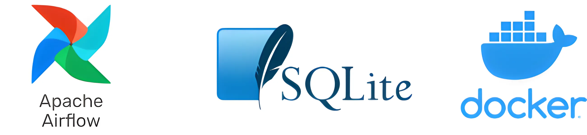

# Airflow SQLite Docker Compose


# Introduction
This repo contains resources for deploying a development Airflow instance with an SQLite metadata backend using Docker Compose. The `./airflow/docker-compose.yaml` is a modified version of the official Airflow [docker-compose.yml](https://airflow.apache.org/docs/apache-airflow/2.8.0/docker-compose.yaml) and is based on instructions from the official Airflow docs for [Running Airflow in Docker](https://airflow.apache.org/docs/apache-airflow/2.8.0/howto/docker-compose/index.html).

Note: These resources are based on Airflow version `2.8.0`. However, I imagine the instructions can apply to all versions `2.x.x` with minor modifications.

## Table of Content
1. [Introduction](#introduction)
2. [Warning](#warnings)
3. [Pre-requisites](#pre-requisites)
4. [Usage](#usage)
5. [Commands](#commands)
6. [References](#references)
7. [Contribution](#contribution)
5. [License](#license)

## Warnings
- The resources in this repo are purely for testing and development purposes and should not be used for production.
- You can only use `SequentialExecutor` with SQLite. If you require a different executor, you should refer to the official Airflow docs for [Running Airflow in Docker](https://airflow.apache.org/docs/apache-airflow/2.7.0/howto/docker-compose/index.html).

## Pre-requisites
- [Docker](https://docs.docker.com/engine/install/)

## Usage
### Clone Repo
- Clone the repo. For example: `git clone https://github.com/kingsabru/airflow-sqlite-docker-compose.git`

### Initial Setup
Run the `init.sh` script to create the supporting folders and `.env` file.
- Make `init.sh` executable: ```chmod +x init.sh```
- Run `init.sh`: ```./init.sh```

### (Option 1) Deploy Airflow without Custom Image
- Start docker containers: `docker compose up -d`

### (Option 2) Deploy Airflow with Custom Image
- Update the `docker-compose.yml`. Comment the line `image: ${AIRFLOW_IMAGE_NAME:-apache/airflow:2.8.0}` and uncomment the line `build: .`. [reference](https://airflow.apache.org/docs/apache-airflow/2.7.0/howto/docker-compose/index.html#special-case-adding-dependencies-via-requirements-txt-file)
- (Optional) Update the `Dockerfile` as necessary. A common change you can make is to modify the Airflow version.
- (Optional) Add custom Python packages to the `requirements.txt` file. Airflow plugins hosted on Pypi can also be added here.
- Build a custom Docker image: `docker compose build`
- Start docker containers: `docker compose up -d`. Alternatively, you can build and start the container automatically using the command: `docker compose up --build -d`

### Login to Airflow UI
- Go to `http://localhost:8080`
- Login with the username and password. The default username and password are `airflow` and `airflow`, respectively.
### (Optional) Configure Connection on Airflow UI
- Go to the menu directory: Admin > Connections
- Click on the `+` icon to add a new record.
- For `Connection Type`, choose the type of connection from the drop-down.
- Input a `Connection Id` value. This will be the name of the connection. Example: clickhouse_conn
- Fill in the rest of the fields as necessary.

### (Optional) Create DAG
New DAGs should be created in the `./dags` folder. Simply create a `.py` Python file and write the logic for the DAG. The result will be visible on the Airflow UI homepage when the file is saved.

### Tear down deployment
- Destroy Docker container: `docker compose down --volumes --remove-orphans`
- Delete the `./db/airflow.db` file.

## Commands
- Build custom Airflow Image: `docker compose build`
- Spin Up Docker Containers: `docker compose up -d`
- Stop Docker Containers: `docker compose stop`
- Start stopped Docker Containers: `docker compose start`
- Destroy Docker Containers: `docker compose down --volumes --remove-orphans`

## References
- [Running Airflow in Docker](https://airflow.apache.org/docs/apache-airflow/2.8.0/howto/docker-compose/index.html)

## Contribution
If you have any suggestions, bug reports, or want to contribute to this userscript, feel free to create issues or pull requests in this GitHub repository.

## License
This project is licensed under the [MIT License](LICENSE).